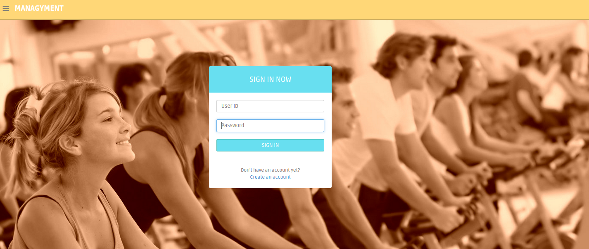
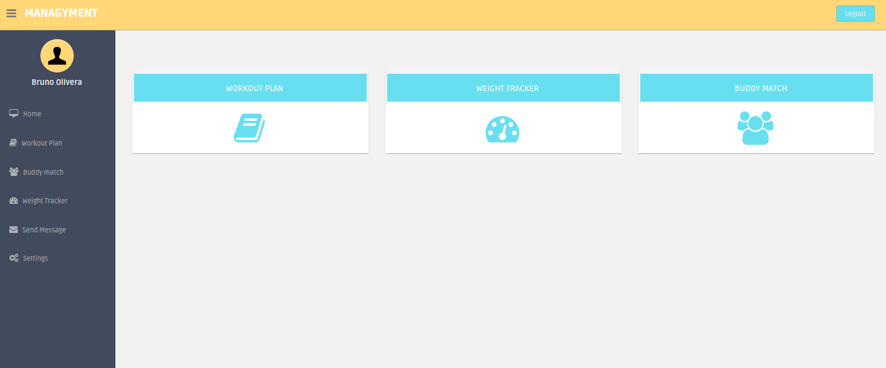
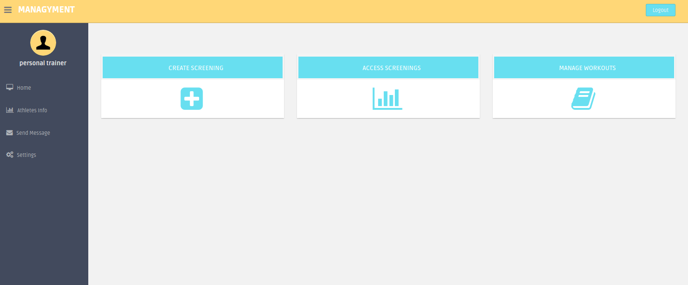
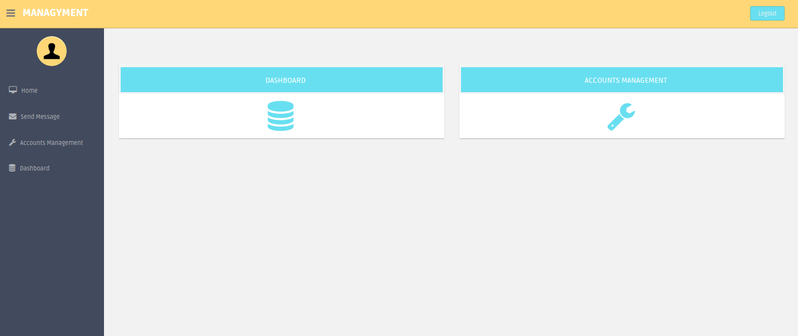

# Managyment - Manage your gym.

Technologies:
------------
  - Backend:
    - Python 2.7
    - Django 1.7.5

  - Frontend:
    - Twitter Bootstrap

Enviroment Setup:
------------
  1. Install Python 2.7 (Linux distributions and OS X already have Python 2.7)
  2. Install pip -> https://pip.pypa.io/en/latest/installing.html
  3. Install virtualenv -> https://virtualenv.pypa.io/en/latest/installation.html
  4. Create a folder with virtualenv -> `$ virtualenv folder`
  5. Activate the virtual enviroment:
      - `$ cd folder`
      - `$ source bin/activate`
  6. Clone this repository for the folder.
  7. Use -> `$ cd project`
  8. Install the dependencies -> `pip install -r requirements.txt`
  8. Runs the server -> `$ python manage.py runserver`

note: the symbol '$' represents the terminal.

Screenshots:
------------
####Login Page

####User Dashboard Page

####Personal Trainer Dashboard Page

####Admin Dashboard Page

License
------------

This is an open source software under the MIT License. You are free to use, copy, modify, distribute and sell it.

Contact:
------------

tarcisiobrunooliveira@gmail.com

